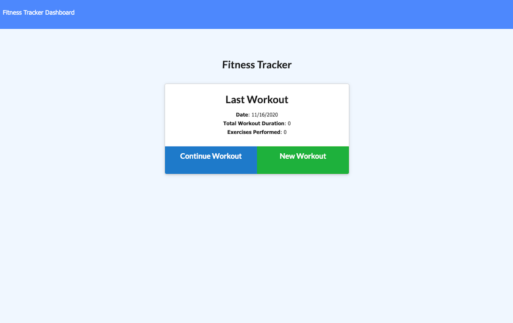
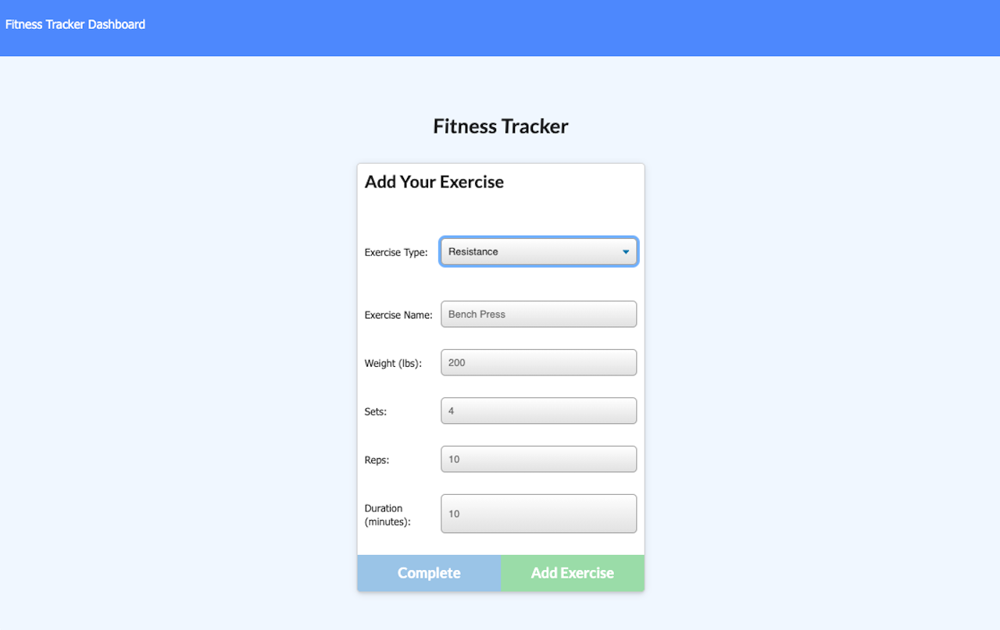
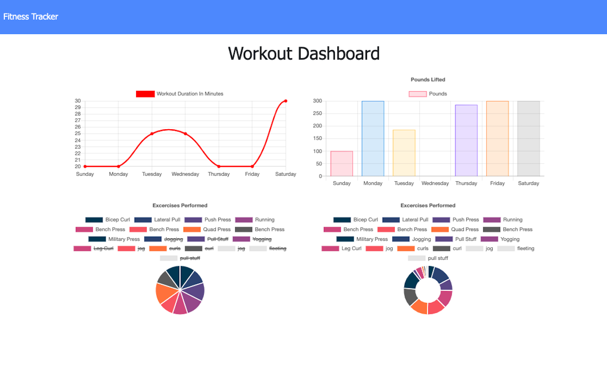

# Workout Tracker

Link to deployed site: [Workout Tracker](https://fierce-hamlet-55434.herokuapp.com/)

## Description
An fitness-tracker app where the user can create and track daily workouts while still able to log multiple exercises in a workout on a given day. They are also able to track the name, type, weight, sets, reps, and duration of the exercise. If the exercise is a cardio exercise you can track the distance traveled.

## How it works
1. Navigate to the app and select 'new workout'
2. Choose between 'resistance' or 'cardio'
3. Select the parameters of the workout-type
4. Select 'add exercise' to add to the existing workout or select 'complete' to complete the workout
5. View 'dashboard' to see the stats of the workouts in progress and/or completed

## App images
1. Home Page

2. Selecting a Resistance Exercise

3. Selecting a Cardio Exercise

4. Dashboard/Stats Page

## Credits/Technologies
1. HTML
2. CSS
3. JavaScript
4. Node.js
5. Express.js
6. Mongoose.js
7. MongoDB
8. Robo 3T